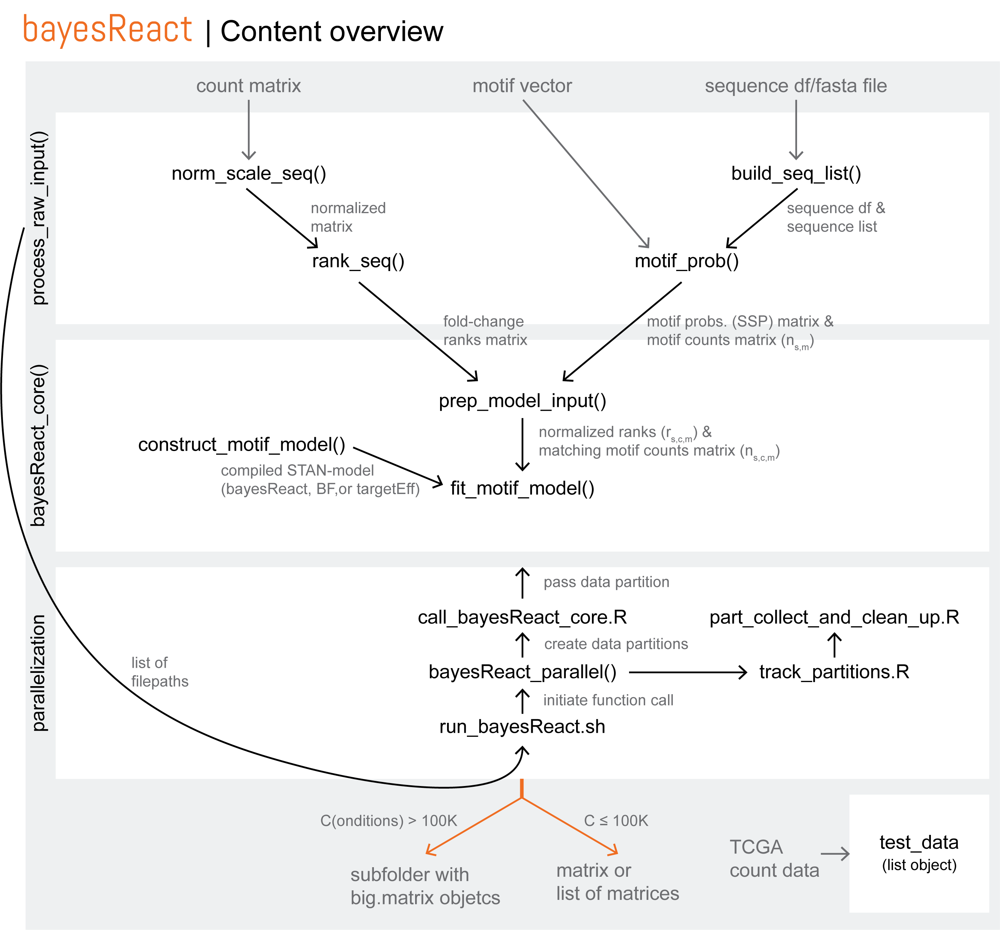

<!-- README.md is generated from README.Rmd. Please edit that file -->
<p align="center">

</p>

<br>

<!-- badges: start -->

[](https://www.r-project.org/)
[](https://mc-stan.org/users/interfaces/rstan)
[](https://www.gnu.org/licenses/gpl-3.0)
[](https://www.tidyverse.org/lifecycle/)
<!-- badges: end -->

bayesReact (BAYESian modeling of Regular Expression ACTivity) is a tool
for probabilistic modeling of regulatory motif distributions across
ranked sequences. It can be used to evaluate whether potential
motif-mediated regulatory mechanisms are active in individual
conditions, such as samples or cells.

A commonly used example is modeling microRNA target sites across 3’ UTRs
from protein-coding genes, ranked by relative expression. Modeling the
microRNA target motif distribution enables indirect inference of the
microRNA activity from bulk, spatial, and single-cell RNA-Seq data when
no expression data from small transcripts is available.

bayesReact is useful for inferring the activity of known regulatory
mechanisms in conditions where they are unobserved, and for de-novo
motif screens to detect surprising motif clustering in experimentally
ranked sequences while accounting for sequence length and nucleotide
composition.

## Installing bayesReact

### Installation with Conda

The bayesReact package is developed to integrate with Conda, and all
dependencies can therefore be installed as follows:

``` bash
conda create -n bayesReact_env r-expm parallel r-rstan r-codetools r-dplyr r-bh r-devtools r-base=4.3
conda activate bayesReact_env
```

Depending on user needs, the following suggested packages can also be
installed through Conda:

- r-bridgesampling (used to compute Bayes Factor for comparing the
  bayesReact model with a uniform null model)
- bioconductor-biostrings and r-stringr (for processing sequence data
  from a fasta file)

In an R session you can then install Regmex and bayesReact:

``` r
if (!requireNamespace("devtools", quietly = TRUE)) {
    install.packages("devtools")
}

devtools::install_github("muhligs/Regmex", dependencies = F)
devtools::install_github("astamr/bayesReact", dependencies = F)
```

### Installation through Devtools

When installing bayesReact and dependencies through R directly, first
ensure to correctly install RStan using their
[tutorial](https://github.com/stan-dev/rstan/wiki/RStan-Getting-Started),
and make sure to follow their guide on configuring the C++ toolchain.

The bayesReact package can then be installed:

``` r
if (!requireNamespace("devtools", quietly = TRUE)) {
    install.packages("devtools")
}

devtools::install_github("astamr/bayesReact", dependencies = T)
```

## User guide and bayesReact overview

Please use the tutorial
[/inst/tutorial_bayesReact.html](https://html-preview.github.io/?url=https://github.com/astamr/bayesReact/blob/master/inst/tutorial_bayesReact.html)
to get started with bayesReact.

Below is an overview of all the functions and scripts included in the R
package and their interconnections.

<p align="center">

</p>

The illustration contains functions and scripts provided in the package
(black) and the data input (grey). Edges depicts the data flow between
function calls. In essence, bayesReact contains three wrapper functions
(white boxes), which the user will mainly interact with:
`process_raw_input()`, `bayesReact_core()`, and `bayesReact_parallel()`.

### Usage

Before getting started, please note that the bayesReact package is
designed for Unix systems (macOS and Linux). For parallelization
`parallel::mclapply()` is used, which does not work on Windows due to
the use of `fork()` for multiprocessing. Subsequently,
`bayesReact_core(model = "BF")` is unavailable for Windows users,
however, `bayesReact_core(model = "bayesReact")` should work.

Additionally, `bayesReact_parallel()` is designed to utilize the queuing
system on a computer cluster and is not advised to be run on a local
machine. Consider instead `bayesReact_core()`.

To summarize:

- **`bayesReact_core(model = "bayesReact")`**
  - Activity inference
  - Compatible with all systems
- **`bayesReact_core(model = "BF")`**
  - Activity inference & Bayes Factor for null model comparison
  - Compatible with Unix systems
- **`bayesReact_parallel()`**
  - Large-scale activity inference for many conditions (C) and motifs
    (M); recommended for C x M \> 50,000
  - Designed for computer clusters (currently supports the Slurm queue
    manager)

## Reference

A detailed description of the underlying model developed for and used in
bayesReact, can be found here:

Rasmussen, A. M., Bouchard-Côté, A., & Pedersen, J. S. (2024).
bayesReact: Expression-coupled regulatory motif analysis detects
microRNA activity in cancer and at the single cell level. *bioRxiv*,
2024-09. Preprint, doi: <https://doi.org/10.1101/2024.09.10.612047>.
